<h1 align="center">Hi there, I'm Thiago Padularrosa ! </h1>

   
   
  💻<strong>Computer Engineer @ UNAJ AI/ML, MLOps & Cybersecurity</strong> 
  Pushing my limits building and writing code that is strong and stable for systems with a clear focus on <strong>SOLID</strong> code.

  

<!-- 🚀 About me -->
<h3 align="center">🚀 About me</h3>

 
  ⚡ I'm passionate about AI/ML and MLOps, with a strong interest in Cybersecurity. 
  📚 I'm a bit like a nerd because I spend most of my time reading a lot of books. 
  🥇 I only like perfection and hard work. 

<h3 align="center">Give me a follow or drop me a line:</h3>

  
  
  
  
  

  
 

<!-- ⭐ Tools i already touch -->
<h3 align="center">📔 Tools I've Had My Hands On</h3>

   
   
   

<!-- 🛠️ Tech Stack -->

  <h3 align="center">💻 Technical Toolkit</h3>
    
    
    
    
    
    
    
    
    
    
    
    
    
    
    
    

<!-- <h3 align="center">Additional Expertise</h3>

  <strong>🚧WIP🚧</strong>

 -->

<!-- 👨‍🎓 Currently Learning things -->
<h3 align="center">🌱 Currently Learning</h3>

  
  
  

<!-- 📊 Github Stats -->
<h3 align="center">📊 Github Stats</h3>

<table align="center">
  <tr>
    <td>
      
    </td>
    <td>
      
    </td>
  </tr>
  <tr>
    <td colspan="2" align="center">
      
    </td>
  </tr>
</table>

<!-- Ending -->

  

Buenos Aires, Argentina · UTC-3

